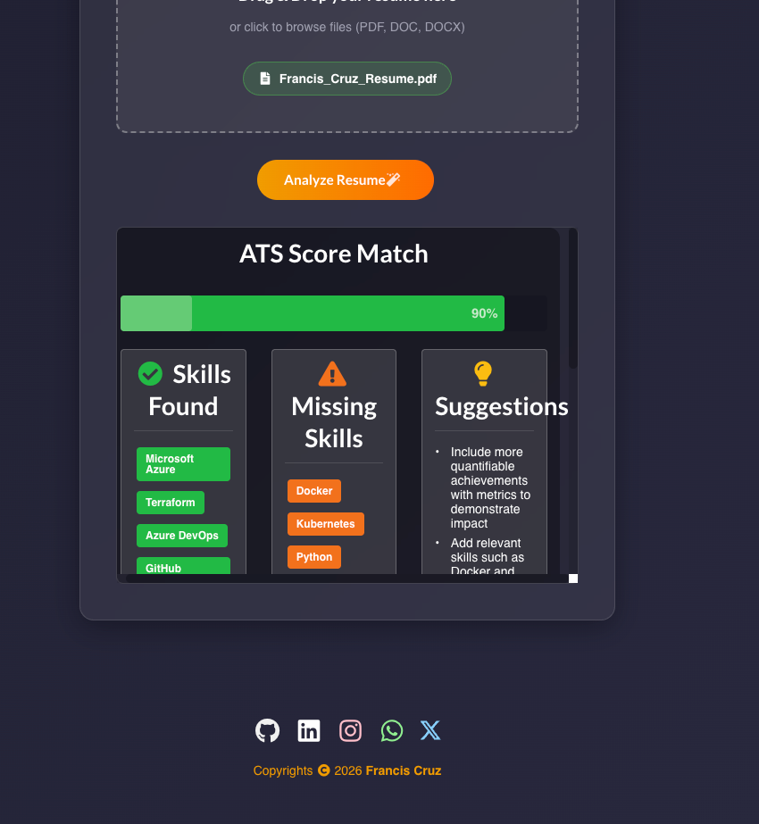
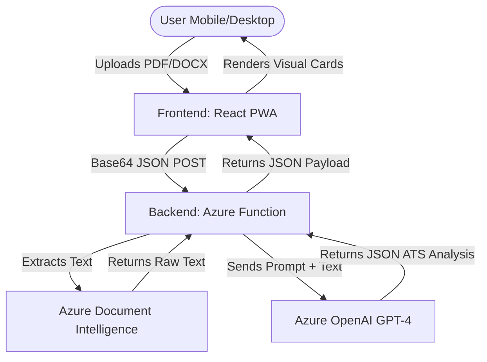

# AI Resume Analyzer

An intelligent, fully responsive, and cloud-hosted application that evaluates your resume against industry standards, extracting key skills, identifying missing skills, and providing actionable suggestions using Azure Document Intelligence and Azure OpenAI.



## Architecture Diagram



## Project Structure

The codebase is split into two distinct parts for easy deployment and maintenance:

```text
.
├── frontend/                 # React UI (Progressive Web App)
│   ├── build/                # Production-ready compiled code
│   ├── public/               # Static assets & manifest.json
│   ├── src/                  # React components, styles, and service workers
│   └── package.json          # Frontend dependencies
│
└── backend/                  # Azure Functions Python Backend
    ├── function_app.py       # Main API endpoint & logic
    ├── requirements.txt      # Python dependencies (azure-ai-formrecognizer, openai)
    ├── host.json             # Azure Function host config
    └── local.settings.json   # Environment variables / Key Vault reference
```

## Features
- **Progressive Web App (PWA)**: Installable on mobile and desktop via Chrome/Safari.
- **Glassmorphism UI**: Modern, sleek, dark-themed responsive UI built with Semantic UI and custom CSS.
- **Robust Parsing**: Uses Azure Document Intelligence to cleanly extract text from any complex PDF or Word resume.
- **AI Analysis**: Uses Azure OpenAI (`gpt-4.1-mini`) for strict JSON-formatted ATS scoring and suggestions.

## Deployment

### Frontend (`/frontend`)
The frontend is a static React app. Build it using `npm run build` and deploy it to Azure App Service or Azure Static Web Apps:
```bash
cd frontend
npm run build
cd build
az webapp up --name <your-app-name> --html --resource-group <your-resource-group>
```

### Backend (`/backend`)
The backend is a Python Azure Function. Deploy it using Azure Core Tools:
```bash
cd backend
func azure functionapp publish <your-function-name>
```
